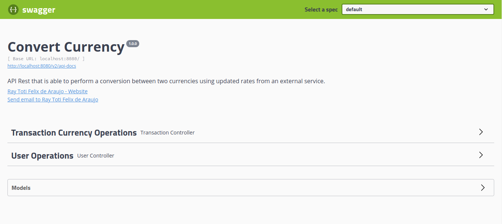
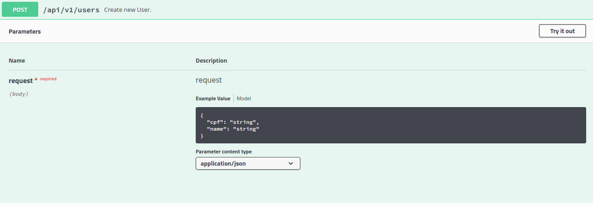

# Convert Currency API

API Rest that is able to perform a conversion between two currencies using updated rates from an external service Exchange Rates API. To carry out the convention, it is necessary to register a user who wants to perform the conversion.

### Exchange Rates API

With over 15 exchange rate data sources, the Exchangerates API is delivering exchanging rates data for more than 170 world currencies.

In this project is used [Latest Rates Endpoint](#latest-rates-endpoint).

#### Latest Rates Endpoint

This endpoint, depending on your subscription plan will return real-time exchange rate data which gets updated every 60 minutes, every 10 minutes, or every 60 seconds.

The Exchange Rates API free plan is limited to 1000 requests per month and has access only to conversions based on the EUR currency, so the project has the intelligence to recover the conversion for both currencies and find the rate that should be applied in the conversion.


#### [Full Exchange Rates API Documentation](https://exchangeratesapi.io/documentation/ "Exchange API Documentation")

---
## How to run?

There are a few ways to use the application:
    
* [Heroku](#in-heroku)
* [Docker](#in-docker)
* [IDE](#in-ide)

### In Heroku

The application is available at [Hekuro](https://convert-currency-ray.herokuapp.com/swagger-ui.html)

### In Docker

Has an image hosted on the Docker Hub:
https://hub.docker.com/repository/docker/raytottifa/convert-currency
```shell
docker pull raytottifa/convert-currency:latest
docker run -p 8080:8080 
    -e API_EXCHANGE_ACCESS_KEY='51feb7685b0f35b307191ac711b3784a' 
    -e API_EXCHANGE_URI='latest?base=EUR&access_key={key}&symbols={to},{from}' 
    -e API_EXCHANGE_URL='http://api.exchangeratesapi.io/' 
    -e DATASOURCE_URL='jdbc:h2:mem:convert' 
    -e DATASOURCE_USER=sa 
    -e DATASOURCE_PASSWORD=admin 
    -e PORT=8080 
    convert-currency
```

### In IDE

#### Getting started

To run the project, you will need to install the following programs:

- [JDK 11: Required to run the Java project](https://www.oracle.com/java/technologies/downloads/)
- [Maven: Required to build the Java project](https://maven.apache.org/download.cgi)
- [IntelliJ IDEA: For project development](https://www.jetbrains.com/pt-br/idea/download/)

#### Development

To start development, you need to clone the GitHub project in a directory of your choice:

```shell
git clone https://github.com/raytotti/convertcurrency.git
```

In the IDE settings Run/Debug it is necessary to inform the main class `Application` and the VM Options below:

```
-DAPI_EXCHANGE_ACCESS_KEY=51feb7685b0f35b307191ac711b3784a
-DAPI_EXCHANGE_URL=http://api.exchangeratesapi.io/
-DAPI_EXCHANGE_URI=latest?base=EUR&access_key={key}&symbols={to},{from}
-DDATASOURCE_URL=jdbc:h2:mem:convert
-DDATASOURCE_USER=sa
-DDATASOURCE_PASSWORD=admin
-DPORT=8080
```

#### Build

To build the project with Maven, run the commands below:

```shell
mvn clean install
```

The command will download all project dependencies and create a target directory with the built artifacts, which include the project's jar file. In addition, tests will be run, and if any fail, Maven will display this information on the console.

---

## How to use?

One of the options is to use the Swagger that is configured in the application at path `/swagger-ui.html`.



And you will have access to the endpoints [Users](#users) and [Transactions](#transaction).

#### Users


To create a user you need to send the post request.



Request example:

```json
{
  "cpf": "722.629.620-90",
  "name": "João da Silva"
}
```

Response body example:

```json
{
  "id": "4faaad29-494e-422d-8aa6-86d9f2762dc8",
  "cpf": "722.629.620-90",
  "name": "João da Silva"
}
```

Response headers example:

```
location: http://localhost:8080/api/v1/users/4faaad29-494e-422d-8aa6-86d9f2762dc8 
```

#### Transaction


To create a transaction you need to send the post request.


Request example:

```json
{
  "destinationCurrency": "BRL",
  "originCurrency": "USD",
  "originValue": 10,
  "userId": "4faaad29-494e-422d-8aa6-86d9f2762dc8 "
}
```

Response body example:

```json
{
  "id": "bf94085f-b266-45d8-bfb1-82f22501937d",
  "userId": "4faaad29-494e-422d-8aa6-86d9f2762dc8",
  "originCurrency": "USD",
  "originValue": 10,
  "destinationCurrency": "BRL",
  "destinationValue": 54.77056,
  "conversionRate": 5.477056,
  "createdAt": "2021-10-06T03:06:00.273882Z"
}
```

Response headers example:

```
location: http://localhost:8080/api/v1/transactions/bf94085f-b266-45d8-bfb1-82f22501937d
```

---

## Monitoring

This application is configured with Spring Boot Actuator by accessing the path `/actuator` you will have access to the monitoring endpoints. As in the example below.

```json
{
    "_links": {
        "self": {
            "href": "http://localhost:8080/actuator",
            "templated": false
        },
        "beans": {
            "href": "http://localhost:8080/actuator/beans",
            "templated": false
        },
        "caches": {
            "href": "http://localhost:8080/actuator/caches",
            "templated": false
        },
        "caches-cache": {
            "href": "http://localhost:8080/actuator/caches/{cache}",
            "templated": true
        },
        "health": {
            "href": "http://localhost:8080/actuator/health",
            "templated": false
        },
        "health-path": {
            "href": "http://localhost:8080/actuator/health/{*path}",
            "templated": true
        },
        "info": {
            "href": "http://localhost:8080/actuator/info",
            "templated": false
        },
        "conditions": {
            "href": "http://localhost:8080/actuator/conditions",
            "templated": false
        },
        "configprops": {
            "href": "http://localhost:8080/actuator/configprops",
            "templated": false
        },
        "configprops-prefix": {
            "href": "http://localhost:8080/actuator/configprops/{prefix}",
            "templated": true
        },
        "env": {
            "href": "http://localhost:8080/actuator/env",
            "templated": false
        },
        "env-toMatch": {
            "href": "http://localhost:8080/actuator/env/{toMatch}",
            "templated": true
        },
        "flyway": {
            "href": "http://localhost:8080/actuator/flyway",
            "templated": false
        },
        "loggers": {
            "href": "http://localhost:8080/actuator/loggers",
            "templated": false
        },
        "loggers-name": {
            "href": "http://localhost:8080/actuator/loggers/{name}",
            "templated": true
        },
        "heapdump": {
            "href": "http://localhost:8080/actuator/heapdump",
            "templated": false
        },
        "threaddump": {
            "href": "http://localhost:8080/actuator/threaddump",
            "templated": false
        },
        "metrics-requiredMetricName": {
            "href": "http://localhost:8080/actuator/metrics/{requiredMetricName}",
            "templated": true
        },
        "metrics": {
            "href": "http://localhost:8080/actuator/metrics",
            "templated": false
        },
        "scheduledtasks": {
            "href": "http://localhost:8080/actuator/scheduledtasks",
            "templated": false
        },
        "mappings": {
            "href": "http://localhost:8080/actuator/mappings",
            "templated": false
        }
    }
}
```
